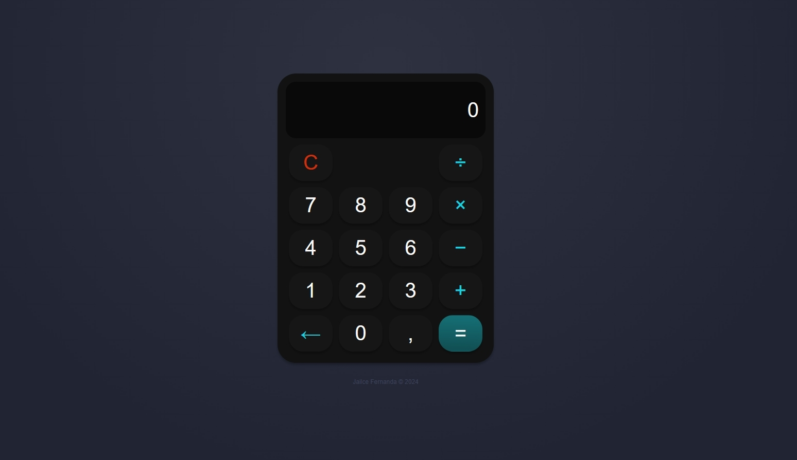

 

# 📌 **Calculadora com React** 
 

Projeto de construção de uma calculadora para realizar operações simples de soma, subtração, multiplicação e divisão utilizando React e Styled-components.

  

## 🧠 **O desafio**
Aplicar os conhecimentos aprendidos em React, criando componentes, utilização de hooks como o useState, arrows functions em JavaScript e aplicação da biblioteca Styled-components do React para acelerar o uso do CSS.
 
<table>
<th>Módulos e temas abordados</th>
<tr>
<td> Criação de componentes no React </td>
</tr>
<tr>
<td> Hook UseState</td>
</tr>
<tr>
<td> Styled Components </td>
</tr>
<tr>
<td> Responsividade </td>
</tr>
</table>
 

## ❤️ Autora
Jailce F.

